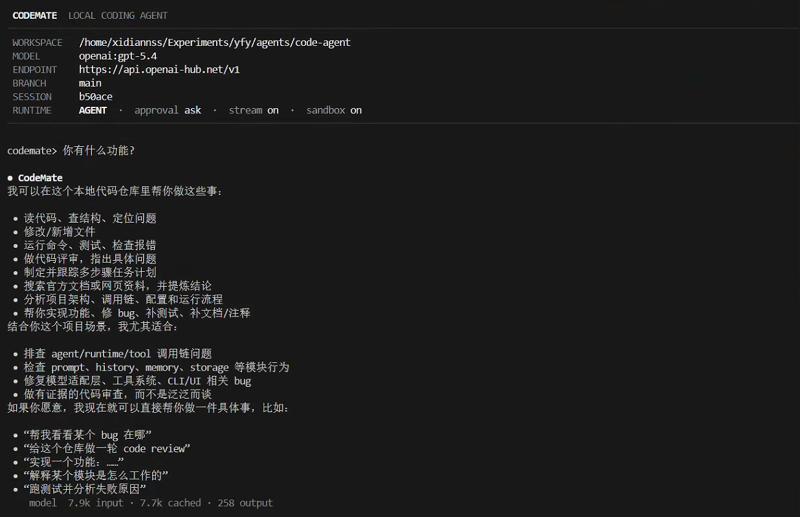
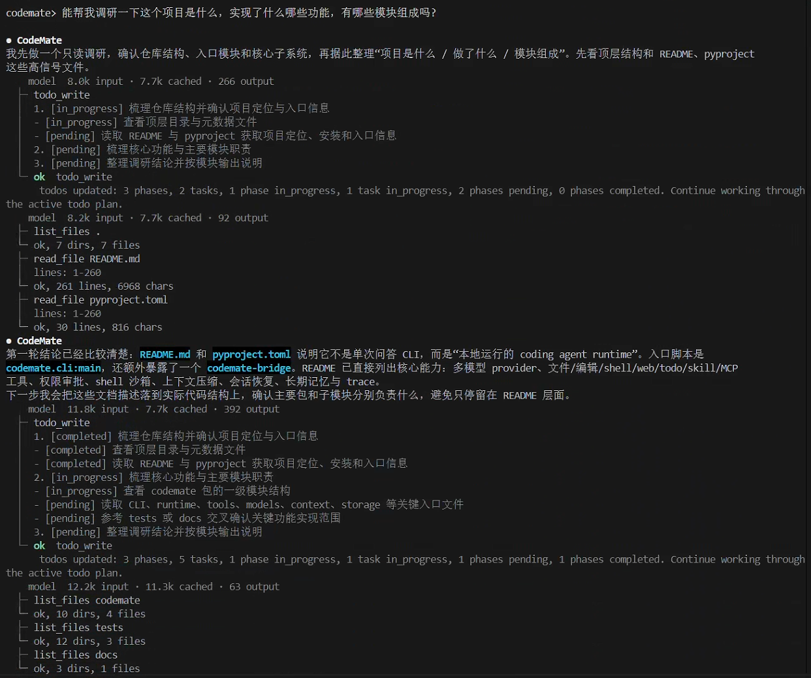
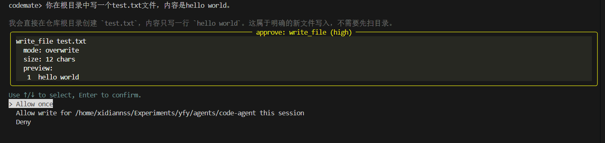
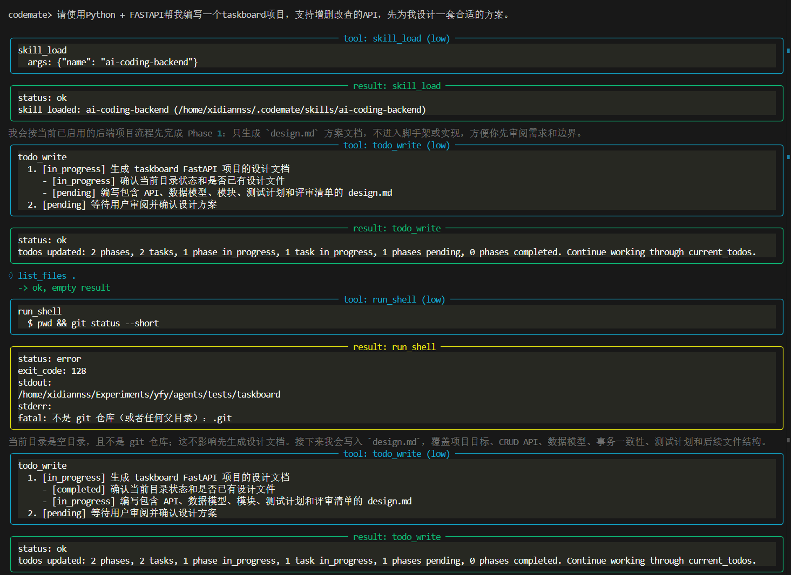
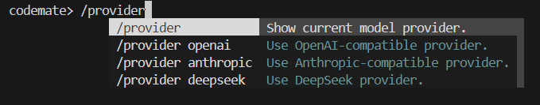
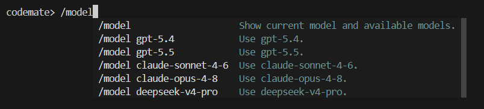

# CodeMate

CodeMate 是一个本地运行的 coding agent。它面向代码仓库工作，通过模型推理、工具调用、权限审批、上下文管理和会话持久化来完成代码阅读、修改、调试、验证和项目调研。

它的目标不是做一个只会发起单次模型请求的 CLI，而是提供一套完整的 agent runtime：模型可以逐轮调用工具，工具结果会进入上下文，运行过程会被记录，长任务可以压缩历史并继续执行，会话可以恢复，权限和沙箱则用于约束文件与 shell 操作的影响范围。

## 运行截图

### CLI 界面

<p align="center">
  
</p>

### 调研类任务

<p align="center">
  
</p>

### 工具权限审批

<p align="center">
  
</p>

### skill + todo规划功能完成项目
#### 规划
<p align="center">
  
</p>

#### 编写
<p align="center">
  
</p>


## 功能特性

- 交互式 CLI 和 one-shot 命令行调用
- OpenAI-compatible、Anthropic-compatible 和 DeepSeek provider 适配
- 内置代码工具：目录浏览、文件读取、正则搜索、文件写入、patch、shell、todo
- Web 工具：基于 Tavily 的搜索、网页提取和研究型搜索
- MCP 接入：支持 stdio、streamable HTTP 和旧版 SSE
- 权限审批：`ask`、`auto`、`read_only`、`full`
- shell 沙箱：基于 `bwrap` 限制shell 权限
- 上下文分层、预算统计和 history compact
- 会话持久化、恢复、重命名和切换
- Skill 加载与卸载
- 长期记忆：候选提取、dream 整理、相关记忆召回
- trace 和 run 记录，便于复盘 agent 的行为

## 快速开始

安装依赖：

```bash
uv sync
```

配置环境变量：

```bash
cp .env.example .env
```

启动交互式 CLI：

```bash
uv run codemate
```

对指定仓库启动：

```bash
uv run codemate --cwd /path/to/repo
```

one-shot 调用：

```bash
uv run codemate "summarize this project"
```

恢复会话：

```bash
uv run codemate --resume
uv run codemate --resume latest
```

## 模型提供商

当前主要支持的 provider 和模型：

```python
PROVIDER_MODELS = {
    "openai": ["gpt-5.4", "gpt-5.5"],
    "anthropic": ["claude-sonnet-4-6", "claude-opus-4-8"],
    "deepseek": ["deepseek-v4-pro"],
}
```

示例：

```bash
uv run codemate --provider openai --model gpt-5.4
uv run codemate --provider anthropic --model claude-sonnet-4-6
uv run codemate --provider deepseek --model deepseek-v4-pro
```

交互式会话中也可以使用 `/provider` 和 `/model` 切换 provider 或模型。
<p align="center">
  
</p>
<p align="center">
  
</p>

## 配置

CodeMate 会自动创建项目级和用户级目录。

项目内配置：

```text
.codemate/
  settings.json
  skills/
```

用户级配置与项目状态：

```text
~/.codemate/
  settings.json
  skills/
  projects/
    <project-id>/
      sessions/
      memory/
```

`.env` 用于配置 provider API、默认模型和 Tavily key。`settings.json` 用于配置 MCP、沙箱和路径权限规则，默认结构如下：

```json
{
  "mcp": {
    "servers": {}
  },
  "sandbox": {
    "enabled": true
  },
  "permissions": {
    "read": {
      "allow": [],
      "deny": []
    },
    "write": {
      "allow": [],
      "deny": []
    }
  }
}
```

项目级配置会覆盖或补充用户级配置。权限规则会被归一化为真实绝对路径，冲突时按 deny 优先处理。

## CLI 命令

交互式 CLI 支持以下命令：

```text
/help                Show help.
/approval            Show current approval policy.
/approval <mode>     Set approval policy: ask, auto, read_only, or full.
/provider            Show current provider and available providers.
/provider <name>     Set provider: openai, anthropic, or deepseek.
/model               Show current model and available models.
/model <name>        Set model from the current provider's allowed model list.
/budget              Show context section sizes and token budget usage.
/compact             Compact older conversation history now.
/memory              Show distilled working memory.
/remember <text>     Add a high-confidence memory candidate.
/dream               Run memory consolidation in foreground.
/dream --background  Run memory consolidation in background.
/session             Show current session information.
/session list        List sessions for this project.
/session rename      Rename the current session.
/session resume      Choose and resume another session.
/reset               Clear current session history and memory.
/exit                Exit.
```

## 工具

CodeMate 的内置工具分为几类：

- File tools: `list_files`, `read_file`, `grep`
- Edit tools: `write_file`, `patch_file`
- Shell: `run_shell`
- Planning: `todo_write`
- Delegation: `delegate`
- Skills: `skill_load`, `skill_unload`
- Web: `web_search`, `web_extract`, `web_research`
- MCP: 动态发现并注册为 `mcp__<server>__<tool>`

工具调用会先经过 schema 和参数校验，再进入权限判断、审批和执行。文件路径会展开 `~`、处理相对路径、解析 `..` 和符号链接，最终以真实绝对路径参与权限判断。

## 权限与沙箱

审批策略：

- `ask`: 默认策略。读写越界、shell 修改、危险操作等会询问用户。
- `auto`: 自动放行低风险读操作和工作区内写操作，风险更高的操作仍会被询问或拒绝。
- `read_only`: 只允许读取、搜索、规划、skill、web 等不会修改文件系统的操作。
- `full`: 面向测试和 benchmark 的高权限模式，跳过大部分审批和 shell 沙箱；极危险命令仍会被硬拒绝。

路径权限分为：

- `read.allow`
- `read.deny`
- `write.allow`
- `write.deny`

权限来源包括默认规则、用户级 `settings.json`、项目级 `settings.json` 和会话内临时 allow。规则聚合后统一用于普通文件工具、shell 路径审批和沙箱构造。deny 优先于 allow。

非 full 模式下，`run_shell` 会先经过命令风险分类和路径审批，再在 `bwrap` 沙箱中执行。沙箱默认以只读方式挂载文件系统，并重新挂载允许写入的目录，用于防止 shell 命令在运行时越过静态检查。

## 上下文与记忆

CodeMate 的上下文分层包括：

- prefix: agent 身份、工具规则、工作流规则、输出规则
- skills: 当前激活的 skill
- working memory: 当前任务相关的结构化短期记忆
- relevant memory: 从长期记忆中召回的相关事实
- history summary: compact 后的旧历史摘要
- recent history: 最近对话和工具结果

可以使用 `/budget` 查看各层字符量、工具 schema 大小、估算 token 和模型上下文预算。历史过大时可以手动 `/compact`，运行时也会在需要时压缩旧 history。compact 只压缩 history，不会压缩 prefix、skills、working memory 或 relevant memory。

长期记忆采用三段式流程：

1. 从会话中定期提取候选记忆。
2. dream 过程整理、去重、消解冲突，形成长期记忆。
3. 每轮请求前根据最近上下文召回相关记忆。

## MCP

MCP 配置写在 `settings.json` 的 `mcp.servers` 中。支持三类连接：

- stdio
- streamable HTTP
- legacy SSE

stdio 示例：

```json
{
  "mcp": {
    "servers": {
      "tavily-mcp": {
        "command": "npx",
        "args": ["-y", "tavily-mcp"],
        "env": {
          "TAVILY_API_KEY": "your-api-key"
        }
      }
    }
  }
}
```

MCP 工具会在启动时连接 server、发现工具，并包装成普通工具注册到 runtime 中。默认审批策略下，MCP 工具会走独立审批；`full` 模式可直接通过。

## 文档

更详细的设计说明见：

- [Design Overview](docs/设计总览.md)
- [CLI / UI](docs/modules/01-cli-ui.md)
- [Model Client](docs/modules/02-model-client.md)
- [Runtime Loop](docs/modules/03-runtime-loop.md)
- [Context Manager](docs/modules/04-context-manager.md)
- [Tool System](docs/modules/05-tool-system.md)
- [Skill and MCP](docs/modules/06-skill-mcp.md)
- [Permission and Sandbox](docs/modules/07-permission-sandbox.md)
- [Memory System](docs/modules/08-memory-system.md)
- [Storage and Trace](docs/modules/09-storage-trace.md)
